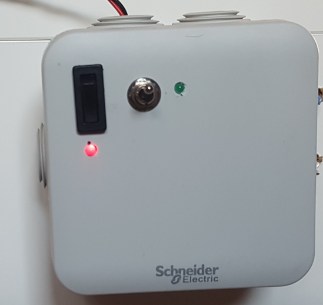
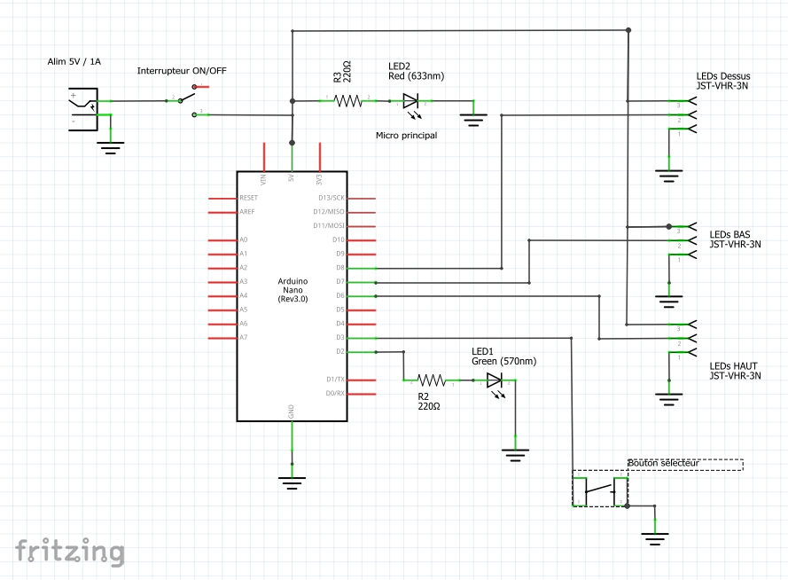
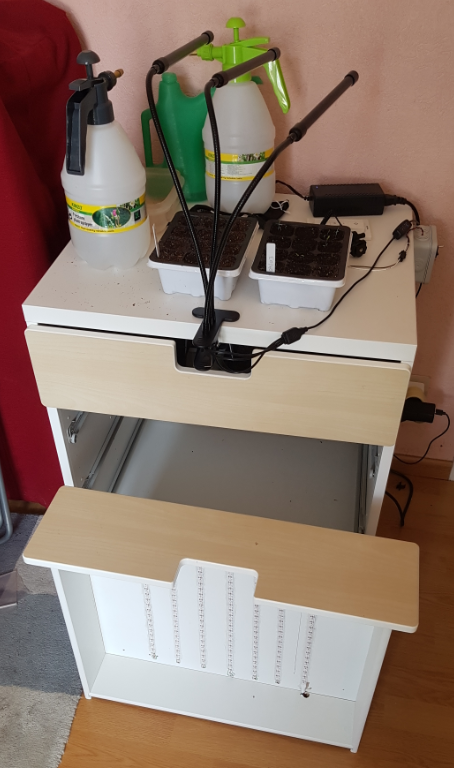

# SEMUINO - ECLAIRAGE ARMOIRE A SEMIS

Toutes les plantes ont besoin de lumière.

Les semis (Graines mises à germer) on aussi besoin de lumière.

Pour une croissance optimale, il faut éclairer les semis pendant une certaine durée journalière et avec un spectre de lumière donné (couleurs).

C'est ce que réalise le meuble à semis sur la photo suivante.

## Description de l'éclairage souhaité

Pendant la phase de germinaison et de croissance, il est conseillé d'éclairer avec une teinte composée de 20% de bleu et 80% de rouge.
La lumière doit être répartie de façon homogène pour éviter que les pousses prenent une direction particulière ou/et ne mollissent.

Nous avons choisi une durée d'éclairage de 16 heures par jour.

Pour se rapprocher du cycle naturel, il y'a une montée de la luminosité pendant les 2 premières heures et une descente les 2 dernières heures de la journée.

Pendant la deuxième phase de croissance, la lumière est blanche. Mais les avis divergent. Le meuble permet donc de choisir plusieurs modes d'éclairage.

## Description du meuble

### Composition du meuble

Il est issu de la récupération d'un vieux meuble cassé et dont nous n'avions plus l'usage. 

Le tiroir du bas est utilisé pour mettre des semis.

Le tiroir du milieu est retourné et servira de plafond au premier étage (en bas).

Au dessus du tiroir du milieu pourront être posé des petits plants de plus grande taille. Un tiroir peut également être inséré au dessus pour permettre de poser d'autres semis.

Des bandeaux de LEDs sont collés au dessus et dans le tiroir du milieu. Ils éclairent de façon homogène les semis des deux étages intérieurs.

Il est prévu d'ajouter un étage au dessus du meuble toujours sur le même principe.

### Mode d'emploi

Le bôtier de commande comporte un interrupteur général et un interrupteur de sélection.

L'interrupteur général permet d'allumer ou d'éteindre le système. Son état est visualisé par la LED rouge qui indique qu'il est bien allimenté.

L'interrupteur de sélection permet de choisir le mode de fonctionnement du système:

Mode | Haut | Bas | Luminosité
------ | ------ | ------ | ------
0 | Eteint | Eteint | Cycle standard
1 | 80%R/20%B | Eteint | Cycle standard
2 | Blanc | Eteint | Cycle standard
3 | Eteint | 80%R/20%B | Cycle standard
4 | Eteint | Blanc | Cycle standard
5 | 80%R/20%B | 80%R/20%B | Cycle standard
6 | 80%R/20%B | Blanc | Cycle standard
7 | Blanc | 80%R/20%B | Cycle standard
8 | Blanc | Blanc | Cycle standard
9 | Démonstration R/G/B | | Maximale
10 | Bleu/Blanc/Rouge fixe | | Maximale

Un bref appui dessus permet de faire défiler les modes. La LED verte s'allume à chaque fois.

Un appui long pendant plus de 5 secondes permet de sauter la phase de montée en luminosité. La LED verte clignote lorsque la commande a été prise en compte.

**Attention:** Le boîtier n'a pas d'horloge. Il gère "bêtement" les horaires. A l'allumage, il monte la luminosité pendant 2 heures puis éclaire à 100% pendant 12 heures et baisse ensuite sa luminosité pendant 2 heures.
Dans l'attente d'une future (hypothétique) horloge dans le boîtier de commande, le meuble doit être allumé par un autre automatisme (Hue par exemple).

 
## Détail technique

### Schéma

### Composants

- Un arduino Nano
- 5 m de LEDs WS28128 5V / 18W / 60 LEDs/m
- composants courants...

# Bilan et configuration finale

La bonne configuration a été obtenue avec 23 x 7 = 161 LEDs à chaque étage.
Le dispositif consomme jusqu'à 19.51 W.

Voir les résultats et mesures [ici](./resultats.md).

Au-dessus du meuble, nous avons fixé la lampe horticole du commerce. Celle-ci est autonome (avec son propre programmateur).

[Voir aussi le diaporama ici](./images/diaporama.pptx).
