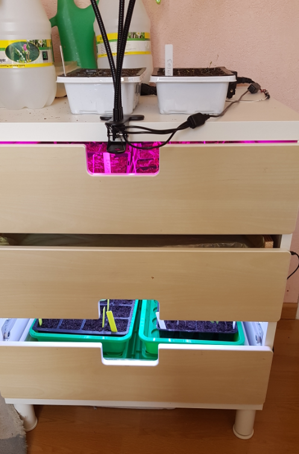
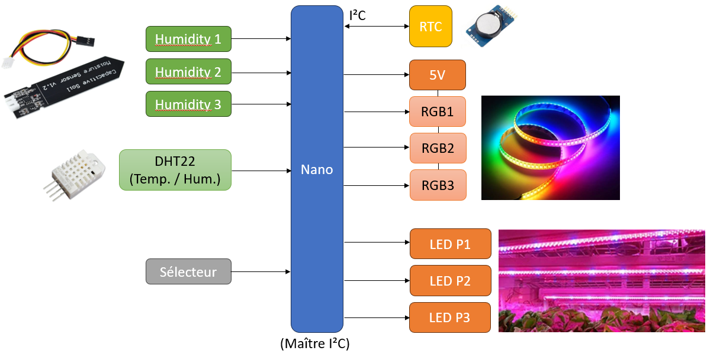
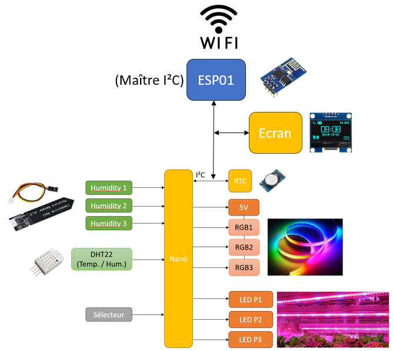
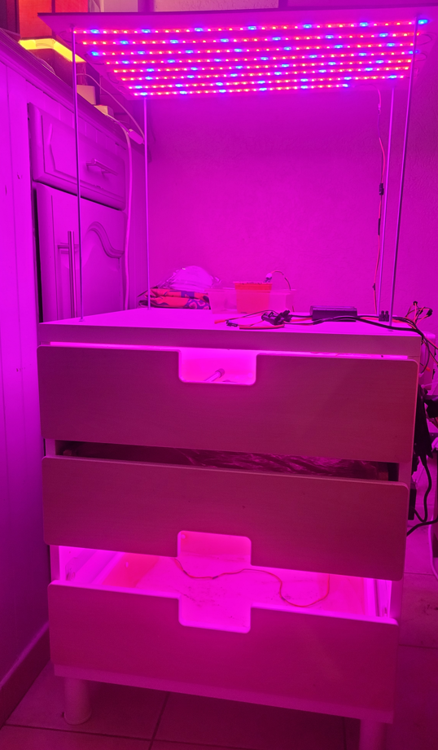
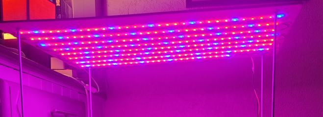

# SEMUINO - ECLAIRAGE ARMOIRE A SEMIS

Toutes les plantes ont besoin de lumière.

Les semis ont aussi besoin de lumière.

Pour une croissance optimale, il faut éclairer les semis pendant une certaine durée journalière et avec un spectre de lumière donné (couleurs).

C'est ce que réalise le meuble à semis sur la photo suivante.



## Description de l'éclairage souhaité

Pendant la phase de germinaison et de croissance, il est conseillé d'éclairer avec une teinte composée de 20% de bleu et 80% de rouge.
La lumière doit être répartie de façon homogène pour éviter que les pousses prenent une direction particulière ou/et ne mollissent.

Nous avons choisi une durée d'éclairage de 16 heures par jour.

Pour se rapprocher du cycle naturel, il y'a une montée de la luminosité pendant les 2 premières heures et une descente les 2 dernières heures de la journée.

Pendant la deuxième phase de croissance, la lumière est blanche. Mais les avis divergent. Le meuble permet donc de choisir plusieurs modes d'éclairage.

## Description du meuble

### Composition du meuble

Il est issu de la récupération d'un vieux meuble cassé et dont nous n'avions plus l'usage. 

Le tiroir du bas est utilisé pour mettre des semis.

Le tiroir du milieu est retourné et servira de plafond au premier étage (en bas).

Au dessus du tiroir du milieu pourront être posé des petits plants de plus grande taille. Un tiroir peut également être inséré au dessus pour permettre de poser d'autres semis.

Des bandeaux de LEDs sont collés au dessus et dans le tiroir du milieu. Ils éclairent de façon homogène les semis des deux étages intérieurs.

Il est prévu d'ajouter un étage au dessus du meuble toujours sur le même principe.

### Mode d'emploi

#### Panneau de commande

Le bouton d'alimentation générale 12V permet d'allumer ou d'éteindre le boîtier. Une LED rouge s'allume lorsque celui-ci est en position "marche".

Le bouton d'alimentation auxiliaire 5V permet d'alimenter les LEDs RGB. Une LED bleue s'allume lorsqu'il est dans la position "marche".

Un bouton de sélection permet de modifier le mode de fonctionnement du meuble. Une LED verte permet d'indiquer à l'utilisateur l'état de fonctionnement du meuble.

#### Principe de fonctionnement du sélecteur

Le meuble a trois modes de fonctionnement que l'on peut sélectionner successivement à l'aide du bouton de sélection.

Mode | Nom | Description
--- | --- | ---
0 | OFF | Toutes les LEDs sont éteintes
1 | Auto/Horloge | Les LEDs s'allument entre 6h et 22h selon un mode d'éclairage défini
2 | ON | Les LEDs s'allument

Le mode choisi est sauvegardé dans le boîtier. Lorsqu'on l'éteint et qu'on le rallume, le réglage est retrouvé.

Lorsqu'on change de mode, la LED verte s'allume une première fois puis clignote rapidement autant de fois que le numéro du mode choisi.

La façon dont s'allume les LEDs (étages allumés) est configurable. Ce réglage est aussi mémorisé par le boîtier.

#### Mode de configuration

Pour entrer dans le mode de configuration, il faut appuyer sur le bouton de sélection pendant plus de 4 secondes. 
La LED verte clignote plusieurs fois très rapidement pour indiquer l'entrée dans le menu.
Elle reste ensuite allumée pour indiquer que l'on est dans le mode de configuration

En appuyant sur le bouton de sélection, on peut faire défiler les différents modes d'éclairage. Les LEDs du meuble s'allument en conséquence.
Lorsque le mode d'éclairage souhaité est rencontré, il faut presser pendant environ 4s sur le bouton de sélection jusqu'à ce que la LED verte s'éteigne.

La LED verte clignote ensuite pour rappeller le mode de fonctionnement en cours (voir partie précédente).

#### Récaputulatif de l'état de la LED verte

Etat | Description
Clignote très rapidement au démarrage | Impossible de lire la date et l'heure: Vérifier la pile 3V à l'intérieur. Le meuble est bloqué.
S'allume une fois puis cliqnote n fois rapidement au démarrage | Indique/rapelle le mode de fonctionnement (autant de foir que le numéro de mode)
Eteinte | fonctionnement normal
Cliqnote n fois rapidement après une action | Indique/rapelle le mode de fonctionnement (autant de fois que le numéro de mode)
Clignote toutes les 2s | La terre est sèche: Il faut probablement arroser
Clignote très très rapidement pusieurs fois puis reste allumée | Entrée en mode de configuration de l'éclairage
Allumée fixe | Mode de configuration en cours

#### Usage du bouton de sélection

Action | Description
--- | ---
Appui court | Changer le mode de fonctionnement (OFF / Auto-Horloge / ON)
Appui long | Entrer en mode de configuration

##### En mode configuration

Action | Description
--- | ---
Appui court | Changer le mode d'éclairage des LEDs du meuble
Appui long | Quitter le mode de configuration (et sauver le réglage)
 
#### Description du mode auto

En mode auto, le semuino gère l'éclairage tout seul de la façon suivante:

- De 6h à 7h, la lumière blanche monte toute seule
- de 7h à 12h, la lumière est de type horticole (LEDs RGB et LEDs 12V majoritairement en rouge spécial)
- de 12h à 14h, la lumière est au maxium (LEDs RGB blanches)
- de 14h à 21h, on revient à l'éclairage horticole normal
- de 21h à 22h, la lumière blanche descend toute seule

## Détail technique

### Schéma et conception

[Schéma et PCB de la carte](board\semuino)

Le carte semuino est architecturée autour d'un arduino nano dans sa configuration réduite "standalone".



Elle comporte les éléments suivants:

- Module Nano;
- module RTC;
- module DHT22 pour mesurer l'humidité et la température ambiante;
- trois Sorties de puissance 12V pour alimenter des LEDs horticoles en mode ON/OFF;
- une alimentation 5V pilotable pour alimenter les bandeaux de LEDs LEDs RGB;
- trois sorties pour bandeaux de LEDs RGB;
- trois entrées pour mesure d'humidité du sol;
- un bouton de sélection de mode;
- une entrée/sortie disponible.

Dans cette configuration, le semuino fonctionne de manière autonome. Il se base sur la date et l'heure pour appliquer l'éclairage souhaité.
Il est également possible de prendre en compte la température et l'humidité (en fonction du programme présent dans le nano).
L'utilisateur peut changer le mode à l'aide d'un bouton de sélection.

La version plus élaborée de la carte semuino comporte en plus un ESP01 et une extension pour connecter un petit écran OLED (type SSD1306 128x64).



Dans cette version, l'arduino Nano devient un simple esclave I²C parmi les autres (RTC et écran). C'est le module ESP01 qui gère tout.
Ce dernier peut aussi fonctionner de façon autonome comme pour la configuration précédente.
Mais il peut communiquer en Wifi et disposer de plus de mémoire pour réaliser plus de choses.

L'ensemble logique de la carte est alimenté en 3.3V (Nano, RTC, ESP01, DHT22, ...). Pour le Nano, il est nécessaire d'ajouter une diode pour permettre l'utilisation simultanée de l'alimentation principale avec celle de l'USB.
Le 3.3V de la carte est appliqué à l'entrée d'alimentation 5V du nano. En effet, la broche 3.3V du Nano est une sortie reliée au régulateur intégré de la puce USB. Elle ne sera pas utilisée.

Tous les composants autour du Nano sont alimentés en 3.3V et sont compatibles avec ce niveau de tension. Le fait que le Nano soit alimenté en ~2.6 peut poser un problème de pilotage du signal de data des LEDs RGB pour lesquels la tension requise pour un niveau haut
est de 0.7 Vcc soit 3.5V. En cas de problème, on peut ajouter "en volant" un adaptateur de niveau 3.3V vers 5V qui fera la conversion. Les premiers essais ont validé le schéma initial.

**Attention:** Selon l'alimentation externe utilisée pour obtenir le 5V, il peut être nécessaire d'ajouter un condensateur de filtrage sur le POWER_5V. Cela a été le cas sur notre prototype. Sans ce condensateur, l'alimentation 5V n'était pas correctement filtrée et le bandeau RGB ne fonctionnait pas. 
Au mieux il clignotait, au pire il affichait des couleurs aléatoires.

### Composants

#### Externes

Nom | Description
--- | --- 
WS2812B 5m 300 LEDs | Bandeau RGB avec 300 LEDs / 5M / 18W
 ? | Capteur d'humidité capatitif
SSD1306 | Ecran OLEB 128x64

#### Sur la carte (principaux)

Nom | Description
--- | --- 
DHT22 | Capteur de température et d'humidité ambiante
Nano | Module Arduino Nano
ESP01 | Module ESP01 (pour connectivité wifi et pilotage de LCD)
RTC | Module RTC avec pile 3V
... | ...

A compléter...

### Les programmes

Il y'a plusieurs types de programmes différents pour l'arduino Nano:
Nom | Description | Lien
--- | --- | ---
semuino_test|Pour tester la carte semuino | 
semuino|Le programme standalone standard pour le Nano |
semuino_nano_slave|Le programme esclave I²C pour le nano |
semuino_nano_master_test|Un programme de test pour remplacer un maître I²C avec un Nano |

Le Nano est quasiment plein niveau RAM. Il n'est pas possible de gérer les trois RGB en même temps. Le RB3 a pour l'instant été retiré.

Pour l'ESP01, il n'y a qu'un seul programme:
Nom | Description | Lien
--- | --- | ---
semuino_wifi|Programme SEMUINO complet pour ESP01 | 

## Protocole d'échange I²C (Esclave Nano)

L'I²C permet à l'ESP01 d'accéder à l'écran, au RTC et au Nano. Cette partie décrit la gestion de l'esclave par le programme du Nano.

### Description des échanges

Adresse de l'esclave: 0xA

Pour écrire une valeur, on envoie le numéro de registre (1 octet) puis la donnée à écrire.

Registre | Nom | R/W  | Taille | Description
--- | --- | --- | --- | ---
1 | Commandes | Ecriture | 1 octet | Contient les commandes pour agir sur les LEDs
2 | Level | Ecriture | 1 octet | Défini le niveau d'éclairage des LEDs RGB (entre 1 et 255)
3 | Modes RGB A | Ecriture | 1 octet | Contient les modes des bandeaux RGB 1 (4 bits de poids faible) et RGB 2 (4 bits de poids fort)
4 | Modes RGB B | Ecriture | 1 octet | Les 4 bits de poids faible correspondent au mode du bandeau RGB 3
5 | WRITE EEPROM | Ecriture | 2 octets | Le premier octet contient l'adresse EEPROM où écrire et le second contient la donnée à écrire

Pour lire une valeur, on envoie le numéro de registre (1 octet) puis on demande la lecture des données.

Registre | Nom | R/W  | Taille | Description
--- | --- | --- | --- | ---
10 | Inputs | Lecture | 1 octet | Retourne l'état des entrées (bit 1: bouton de select)
11 | TEMP | Lecture | 1 octet | Retourne la température ambiante (en °C)
12 | HUM | Lecture | 1 octet | Retourne le taux d'humidité ambiante (en %)
13 | H1 | Lecture | 1 octet | Retourne la valeur du capteur d'humidité du sol n° 1 (0..255)
14 | H2 | Lecture | 1 octet | Retourne la valeur du capteur d'humidité du sol n° 2 (0..255)
15 | H3 | Lecture | 1 octet | Retourne la valeur du capteur d'humidité du sol n° 3 (0..255)
16 | READ EEPROM | Lecture | 1 octet | Il faut d'abord écrire 1 octet d'adresse, avant de lire l'octet contenant la valeur.

### Quelques exemples

Pour envoyer des commandes: [0x0A] [1] [0x01] (Tout coupé sauf le 5V) 

Pour changer le niveau d'intensité des RGB: [0x0A] [2] [255] (Tout à fond)

Lire l'adresse 4 en EEPROM : Ecrire [0x0A] [5] [4] puis lire [0x0A] [Donnée reçue]

Ecrire 0x55 à l'adresse 4 en EEPROM: Ecrire [0x0A] [16] [4] [0x55]

## Spécification du Webservice ESP01

### Information

La requête suivante permet de récupérer les informations d'identification du service.

GET /semuino/info

```

{
  "type":"semuino_info",
  "version":"V1.0",
  "description":"API de commande du semuino / Gestion du meuble à semi.",
  "github":"https://github.com/bpmine/modules_uino/tree/master/semuino"
}

```

### Choix du mode manuel/auto

GET /semuino/mode
POST /semuino/mode

```

{
  "type":"semuino_mode",
  "mode":"manual"
}

```

Les deux modes possibles sont `manual` et `auto`.
En mode manuel, l'utilisateur pilote directement le semuino en postant des commandes avec `/semuino/cmds`.
En mode automatique, il modifie la configuration si nécessaire avec `/semuino/set`.

### Commandes des LEDs

Seulement en mode manuel. Pour envoyer des commandes.

POST /semuino/cmds

```

{
  "type":"semuino_cmds",

  "cmd5v":true,
  "rgb1":true,
  "rgb2":true,
  "rgb3":true,
  "modergb1":2,
  "modergb2":1,
  "modergb3":1,

  "cmdp1":true,
  "cmdp2":false,
  "cmdp3":false
}

```

Champ | Plage | Description
--- | --- | ---
cmd5v | false..true | Active ou non l'alimentation 5V des LEDs RGB
rgb1 | false..true | Active le bandeau RGB1
rgb2 | false..true | Active le bandeau RGB2
rgb3 | false..true | Active le bandeau RGB3
modergb1 | 0..15 | Défini le mode de fonctionnement du bandeau RGB 1
modergb2 | 0..15 | Défini le mode de fonctionnement du bandeau RGB 2
modergb3 | 0..15 | Défini le mode de fonctionnement du bandeau RGB 3
cmdp1 | false..true | Active le bandeau de LED 12V n°1
cmdp2 | false..true | Active le bandeau de LED 12V n°2
cmdp3 | false..true | Active le bandeau de LED 12V n°3


### Lecture des valeurs des capteurs

*GET /semuino/sensors*

```

{  
  "type":"semuino_sensors",

  "date":"12/12/2023",
  "time":"10:45:01",
  "temp":25,
  "hum":70,
  "hum1":100,
  "hum2":111,
  "hum3":45
}

```

Champ | Plage | Description
--- | --- | ---
date | dd/mm/yyyy | Date du module RTC
time | HH:MM:SS | Heure du module RTC
temp | -40..100 | Température ambiante (en °C)
hum | 0..100 | Taux d'humidité ambiant (en %)
hum1 | 0..255 | Valeur lue sur le capteur d'humidité 1
hum2 | 0..255 | Valeur lue sur le capteur d'humidité 2
hum3 | 0..255 | Valeur lue sur le capteur d'humidité 3

### Configuration du mode automatique

*GET /semuino/set*
*POST /semuino/set*

```

{
  "type":"semuino_set",

  "date":"14/11/2023",
  "time":"12:12:02",

  "sunrise":"07:00",
  "sunset":"22:00",

  "modergb1":2,
  "modergb2":1,
  "modergb3":1
}

```

# Bilan et configuration finale

## Photos

### Vue globale



### Plaque du dessus



La plaque du dessus comporte 258 LEDs horticoles de 12V. Elle a été ajoutée sur le meuble en 2024.

### Boîtier de commande

A rajouter...

## Consommation

### Leds 12V

#### Pour chacune des deux étagères

Nombre de LEDs: 21 x 8 = 168
Courant à 12V: 1,5 A (9 mA par LED)

Chaque rangée de LEDs a 4 LEDs bleues et 17 LEDs rouges

#### Pour le panneau du dessus

Nombre de LEDs: 258
Courant à 12V: 2 A (7,8 mA par LED)

#### Consommation totale LEDs 12V

1,5 x 2 + 2 = 5 A (8 mA par LED)

NB: Mesure confirmée lors du premier essai avec la carte + les 3 panneaux de LEDs 12V.

Cela fait un total de 60 W pour les LEDs 12V.

### Consommation des LEDs RGB

Suite à un problème avec l'alimentation 12V->5V, cet essai est effectué à l'aide d'une alimentation 5V extérieure.

Etage | Couleur | Courant | Tension | Puissance
-- | -- | -- | -- | --
Haut | Blanc | 2,06 A | 5,34 V | 11 W
Haut | Rouge | 0,79 A | 5,45 V | 4,3 W
Bas | Blanc | 1,97 A | 5,36 V | 10,6 W
Bas | Rouge | 0,77 A | 5,45 V | 4,2 W

NB: Il n'y a pas assez de mémoire pour utiliser la lib RGB classique avec la voie RGB3. Cette dernière ne sera donc pas utilisée. On pourra
peut être réduire le besoin mémoire en allumant tout le bandeau avec la même couleur (bibliothèque à chercher ou bien à coder).

Il y'a 7 rangées de 23 LEDs RGB sur chaque étage. Soit 161 LEDs par étage.
En blanc, cela fait 13 mA par LED.

Pour deux étages, cela fait un total (mesuré) de 3.85 A @ 5.22 V, soit 20 W en mode blanc.

Idéalement, il faudrait prévoir 7 A / 5 V pour trois étages.

### Bilan des consommations

En tout, le meuble à semis consomme actuellement 80 W avec deux étages RGB montés. On peut prévoir 95 W si un jour on utilisait l'étage RGB du dessus.
Donc un fusible principal de 7 A ou de 9 A peut être utilisé pour protéger la carte. Et l'alimentation extérieure doit bien débiter 10 A pour avoir un peu de marge.

## Eclairage

Les mesures suivantes sont réalisées avec un smartphone et l'application "Luxmetre".

### Panneau du dessus du meuble

A environ 40cm, 300 LUX

### Etage du haut en position 15cm

Description | Eclairage
--- | ---
RGB Blanc | 1000 LUX
RGB horticole | 525 LUX
12V horticole | 1000 LUX
12V + RGB horticole | 1610 LUX
12V + RGB blanc | 2100 LUX

En mode auto, cela donne le scénario suivant:

Plage horaire | Eclairage
--- | ---
6h à 7h | de 0 à 1000 LUX
7h à 12h | 1600 LUX
12h à 14h | 2000 LUX
14h à 21h | 1600 LUX
21h à 22h | 1000 LUX à 0

### Etage du bas en position 30cm

Description | Eclairage
--- | ---
RGB Blanc | 800 LUX
RGB horticole | 430 LUX
RGB vert | 425 LUX
RGB bleu | 449 LUX
12V horticole | 583 LUX
12V + RGB horticole | 1019 LUX
12V + RGB blanc | 1400 LUX

NB: Vert et Bleu n'ont pas d'intérêt pour le meuble de semis...

En mode auto, cela donne le scénario suivant:

Plage horaire | Eclairage
--- | ---
6h à 7h | de 0 à 800 LUX
7h à 12h | 1019 LUX
12h à 14h | 1400 LUX
14h à 21h | 1019 LUX
21h à 22h | 800 LUX à 0

## Difficultés rencontrées

### Défauts de conception

- Le temps pour réaliser les panneaux de LEDs (soudure, câblage, collage, ...);
- petite erreur sur l'alimentation de l'arduino: Un Nano s'alimente en 5V ! Et on ne doit pas utiliser son 3.3V pour alimenter des composants à l'extérieur (il provient du contrôleur USB);
- oubli de condensateur(s) de filtrage sur l'alimentation 5V: Cela rendait instable le fonctionnement des LEDs RGB;
- la taille de RAM trop réduite sur le nano, vu les fonctionnalités souhaitées;
- première alimentation de 5V sous-dimensionnée: Elle doit fournir au moins 5A.

Pas trop de soucis pour rattrapper tout ça avec le PCB initial:
  - On coupe la piste au niveau du 3.3V de l'arduino pour la reporter via une diode sur le 5V de l'arduino.
Donc on va alimenter l'arduino nano en 3.3V (~2.5V à ca&use de la diode) à partir de sa broche 5V.
  - On ajoute un condensateur en volant en sortie sur le bloc alim 12V->5V.
  - Pour la RAM, si on accepte 1 à 2 couleurs par étage (avec une règle du type "1 LED sur 3 Bleue et les autres rouge"), alors il est possible de ne pas utiliser de tableau pour mémoriser la couleur de chaque LED.
  - Pour régler définitivement le problème d'alim 5V, un bloc extérieur est finalement utilisé pour alimenter directement les bandeaux RGB. On perd la possibilité de commander en ON/OFF cette alim.

### "Comment j'ai pété les LEDs RGB"

*Question:* Que se passe-t'il quand on confond l'interrupteur du bas et celui du haut au moment de câbler le tout ?

*Réponse:* Alors on alimente les bandeaux de LEDs 5V en 12V et c'est pas bien !!


C'est ce qui m'est arrivé. Le résultat n'est pas très drôle puisque j'ai cramé toutes les 322 LEDs RGB du meuble dans une triste "pétarade".

La plupart ne s'allumaient plus et 3 ou 4 au contraire restaient allumées sur une couleur fixe.

Dommage!

NB: Armé d'un peu de patience, je les ai finalement remplacé...

### Améliorations possibles sur la future version

- Déplacer les borniers pour faciliter les branchements (ou utiliser des embase sur le PCB 
- Prévoir l'alimentation 5V des RGBs extérieure dès le départ et la rendre pilotable par le nano
- Remplacer l'alimentation 3.3V en 5V pour tout alimenter en 5V et ajouter un régulateur dédié pour le 3.3V de l'ESP01 (Vérifier qu'il est bien 5V tolerant et si ce n'est pas le cas, mettre un buffer pour son accès I²C).

# Version précédente du meuble à semis V0 (Hiver 2021)

Une première version du meuble a été mise en ligne en 2021.

Pour accéder à l'ancienne version de cette page, cliquer [Ici](./readme_v0.md).
Voir le tag *semuino_prototype_2021* du git pour avoir l'intégralité des sources de cette version.


